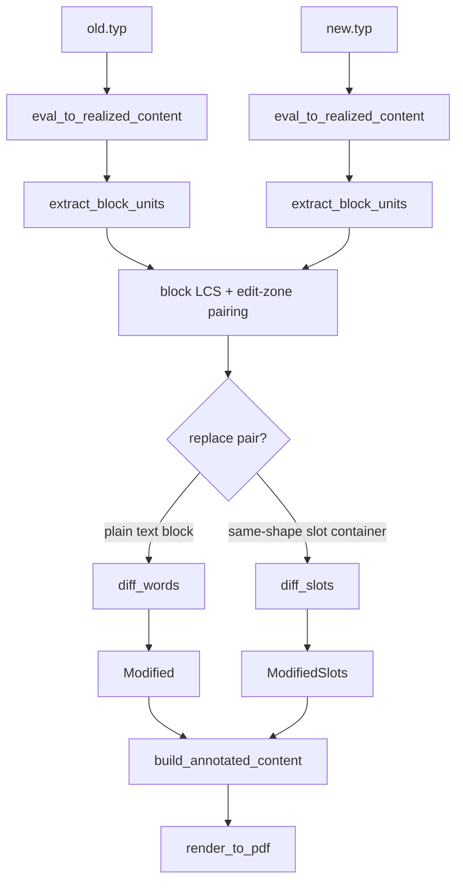
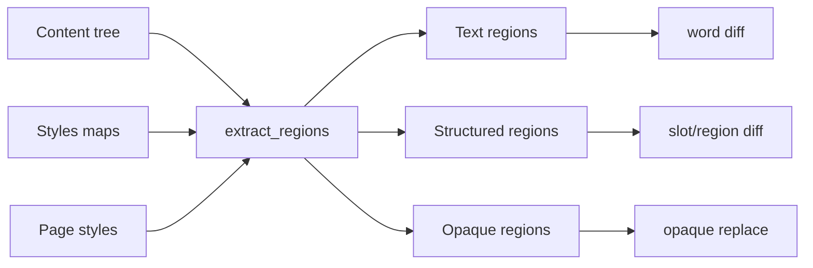

# Container Diff Regions

This note documents the current container-diff failure modes behind Corpus 32,
35, 45, and 46, and proposes a cleaner abstraction for fixing them. It is a
design note only; it does not describe implemented behavior.

## Problem Summary

The current diff works well when changed text is reachable as normal `Content`
children:

```text
Content
└── TableElem
    ├── cell body: Content
    ├── cell body: Content
    └── cell body: Content
```

`content_slots::extract_slots` can collect those cell bodies, `diff_slots` can
compare corresponding cells, and `replace_slot` can write annotated content
back into the table.

The failing corpus cases all involve text-bearing regions that are not handled
by that narrow model:

| Corpus | Symptom | Root cause |
|---|---|---|
| 32 headers/footers | Header changes are not shown as old/new annotations. | Header/footer content lives in page styles, not in document blocks. |
| 35 table changed | The table is flattened into inline text. | The old/new tables have different cell counts, so slot paths do not match and the diff falls back to whole-block word diff. |
| 45 showybox | No changes are detected. | The package expands into styled/layout blocks whose visible body text is not exposed as ordinary child content or `plain_text()`. |
| 46 Cetz | Paragraphs diff, but diagram changes are opaque. | The canvas renders labels visually, but the diagram is not a normal text-bearing content subtree. |

The current slot abstraction is therefore useful but incomplete. It handles
"element fields that are direct content children"; it does not handle
style-backed content, page-style content, or opaque rendered regions.

## Current Algorithm

At a high level, the current pipeline is:



The key decision is inside `diff_content`: when a deleted block and inserted
block are paired as a replacement, `diff_slots` gets the first chance to handle
the pair. If `extract_slots(old)` and `extract_slots(new)` have the same paths,
the pair becomes `ModifiedSlots`. Otherwise the diff falls back to `Modified`,
which is a flat word-level diff over the whole block.

That is why same-shape tables work and Corpus 35 does not:

```text
same-shape table
old slots: [TableCell(0), TableCell(1), TableCell(2)]
new slots: [TableCell(0), TableCell(1), TableCell(2)]
result:    ModifiedSlots, table structure preserved

changed-shape table
old slots: [TableCell(0), ..., TableCell(8)]
new slots: [TableCell(0), ..., TableCell(11)]
result:    Modified, table flattened by inline word annotation
```

## Why More Special Cases Would Be Fragile

One possible fix is to keep adding container-specific behavior:

- Special-case table shape mismatches.
- Special-case `PageElem::header` and `PageElem::footer`.
- Special-case showybox's generated block shape.
- Special-case Cetz as an opaque graphic.

That would work for these four examples, but it would keep the implementation
coupled to today's Typst/package expansion details. It would also duplicate
the same idea several times: find a meaningful text-bearing or opaque region,
diff it, and write the annotated result back where it came from.

The cleaner abstraction is to generalize "slot" into "diffable region".

## Proposed Abstraction: Diff Regions

A `DiffRegion` is any independently diffable part of a block or style context.
It can be text-bearing, structured, or opaque.

Sketch:

```rust
struct DiffRegion {
    path: RegionPath,
    kind: RegionKind,
    content: Content,
    text_key: String,
}

enum RegionKind {
    Text,
    StructuredContainer,
    PageHeader,
    PageFooter,
    Opaque,
}
```

Important differences from today's `ContentSlot`:

- A region can live in an element field, a `StyledElem.styles` property, or a
  page style.
- A region can be opaque and still meaningful if its structural content changed.
- Region replacement knows how to write back to the same place the region came
  from.
- The abstraction can represent both "table cell 3" and "page header" without
  making either one a top-level block.

Conceptually:



## How This Addresses Each Case

### Corpus 32: Headers and Footers

The current algorithm copies the new root page styles to the final output.
There is no old/new comparison for the header content.

With regions:

```text
old root styles -> PageHeader("Old Report Title --- Draft")
new root styles -> PageHeader("New Report Title --- Final")
```

The header becomes a region pair. The diff can produce annotated header content
and write it back into `result.root_styles` or into a page-style wrapper group.

Expected behavior: the rendered header shows old title fragments struck and new
title fragments inserted, while the footer remains unchanged.

### Corpus 35: Table Shape Change

The current `diff_slots` requires equal slot paths. That is correct for precise
cell-level modification, but a shape mismatch should not fall all the way back
to flat inline text.

With regions, a table is a structured region. If its child regions cannot be
aligned safely, the fallback should remain structural:

```text
old table -> Deleted structured region
new table -> Inserted structured region
```

This is less fine-grained than cell alignment, but it preserves the table.
A later row/cell alignment pass can improve precision without changing the
fallback contract.

### Corpus 45: Showybox

The showybox package expands to layout/styled blocks. The visible body text is
not currently available through `extract_slots`, and `plain_text()` on the
realized block sequence only sees the heading.

With regions, extraction would inspect style-backed body properties and wrapper
body content consistently. The package-generated box body can become a normal
text region even though it is not a source-level `BlockElem` child in the shape
we expected.

Expected behavior: each box body becomes diffable text, while the box frame and
title styling stay intact.

### Corpus 46: Cetz

Cetz diagrams should be treated as opaque graphics unless the package exposes
normal Typst content regions. The surrounding prose already diffs correctly.

With regions, the canvas block can be classified as opaque:

```text
old opaque canvas != new opaque canvas
```

The initial behavior can be conservative: preserve old and new diagrams as a
delete/insert pair, or mark the diagram as replaced without attempting label
word diffs. This avoids silently treating a changed diagram as equal just
because its `plain_text()` is empty.

## Proposed Implementation Shape

The implementation can evolve in layers:

1. Rename or wrap `ContentSlot` as `DiffRegion` while preserving current slot
   behavior.
2. Add style-aware traversal so wrapper bodies supplied through `StyledElem`
   styles are extracted and replaceable.
3. Add page-style region extraction for headers and footers.
4. Change structured-container shape mismatch fallback from flat `Modified` to
   structural delete/insert.
5. Add opaque-region detection for changed empty-text blocks.

This sequence keeps the existing successful cases working while making the
abstraction broader. The important rule is: if a region is structurally
important enough to preserve, it must never be flattened merely because its
children do not align.

## Open Design Questions

- How should region paths address style properties? They need to be stable and
  replaceable, but they should not expose too much Typst-internal detail.
- Should page header/footer diffs appear in the modification log as synthetic
  slots, e.g. `PageHeader`, `PageFooter`?
- For table shape mismatches, is structural delete/insert sufficient, or should
  row/cell alignment be part of the first implementation?
- How should opaque replacements render visually? Options include old+new
  stacked, a red/green frame, or an explicit textual marker around the graphics.
- Should package-generated regions be diffed after realization only, or should
  some package calls be preserved before realization like other slot containers?

## Recommended First Cut

The cleanest first cut is not to solve every package perfectly. It is to make
the fallback rules structurally safe:

- style-backed wrapper bodies are extractable regions;
- page header/footer content is diffed as regions;
- structured containers are never flattened when region alignment fails;
- opaque changed blocks are not silently equal.

That would fix the visible failures in the cited corpus cases while reducing,
not increasing, the number of special cases in the diff/annotation pipeline.
