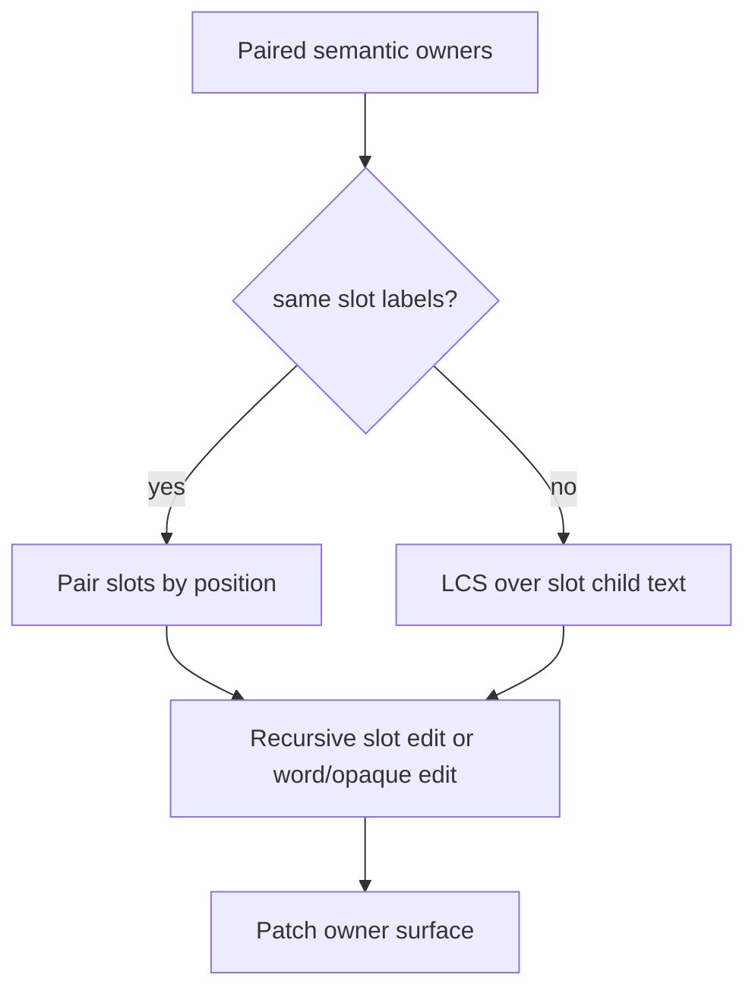

# typst-diff — Technical Reference

## Table of Contents

1. [Overview](#overview)
2. [Crate structure](#crate-structure)
3. [Pipeline walkthrough](#pipeline-walkthrough)
4. [Module reference](#module-reference)
   - [world](#world)
   - [eval](#eval)
   - [diff](#diff)
   - [annotate](#annotate)
   - [render](#render)
   - [diag](#diag)
   - [debug and trace](#debug-and-trace)
5. [Key data structures](#key-data-structures)
6. [Algorithms in depth](#algorithms-in-depth)
   - [Block extraction](#block-extraction)
   - [Slots and regions](#slots-and-regions)
   - [Block-level LCS diff](#block-level-lcs-diff)
   - [Edit zone pairing](#edit-zone-pairing)
   - [Word-level diff](#word-level-diff)
   - [Similarity metric](#similarity-metric)
7. [Annotation strategy](#annotation-strategy)
8. [Rendering and layout convergence](#rendering-and-layout-convergence)
9. [Git revision mode](#git-revision-mode)
10. [Debugging and tracing](#debugging-and-tracing)
11. [Performance notes](#performance-notes)
12. [Limitations and known edge cases](#limitations-and-known-edge-cases)

---

## Overview

typst-diff compares two Typst documents and produces a PDF that highlights
word-level changes: insertions in green, deletions in red strikethrough.

Unlike source-level diffing tools (e.g. `latexdiff`), typst-diff operates on
the *evaluated* Content trees produced by the Typst compiler. This means:

- `#include` directives and user-defined functions are fully expanded before
  diffing.
- Structural differences caused by macro expansion (not visible in source)
  are captured.
- The output is a valid Typst PDF, rendered with the new document's fonts and
  assets.

The cost is that eval is required for both documents, even for trivially small
changes.

---

## Crate structure

```
src/
├── lib.rs             — library root; public re-exports
├── main.rs            — CLI binary: argument parsing + orchestration
├── world.rs           — World trait implementation (filesystem + fonts)
├── eval.rs            — Content tree extraction from a World
├── annotated.rs       — Realized tree plus semantic annotations
├── attributed_block_stream.rs
│                      — Per-block semantic owner/equation/footnote attribution
├── container_ops.rs   — Container-owned slot mapping and patch surfaces
├── content_tree.rs    — Shared tree navigation and rewrite helpers
├── content_key.rs     — Named comparison keys for equality/similarity/presentation
├── patch_surface.rs   — Typed non-realized edit surface reasons
├── diff_surface.rs    — Named diff surface kinds
├── diff_area.rs       — Named diff area kinds
├── edit_script.rs     — Shared ordered edit-script builder
├── style_context.rs   — Page/non-page style partitioning
├── diff.rs            — Block, semantic-owner, slot, word, and region diff
├── annotate.rs        — Build annotated Content from a DiffResult
├── render.rs          — layout_document + typst_pdf → Vec<u8>
├── diag.rs            — Diagnostic formatting (file:line:col messages)
├── debug.rs           — YAML debug bundle and JSONL trace serialization
└── trace.rs           — Trace event types and sink trait
```

The crate is both a library and a binary. `src/lib.rs` exports the public API
so integration tests in `tests/` can call into individual pipeline stages.

See [Container Diff Regions](container-diff-regions.md) for a design note on
the next step after the current slot abstraction.
See [Figure and Opaque Diffs](figure-and-opaque-diffs.md) for the figure and
caption regression cluster as a worked example of semantic owners and patch
surfaces.

---

## Pipeline walkthrough

```
old/main.typ ──► SystemWorld A ──► eval_to_realized_content ──► old_content: Content
                                                                       │
new/main.typ ──► SystemWorld B ──► eval_to_realized_content ──► new_content: Content
                                                                       │
                                                        diff::diff_annotated(&old, &new)
                                                                       │ DiffResult
                                                        annotate::build_annotated_content_from_tree
                                                                       │ Content
                                               render::render_to_pdf(content, world_b)
                                                                       │
                                                                    diff.pdf
```

The new document's world (World B) is used for both annotation and rendering
because fonts and binary assets resolve relative to it. World A is only used
during evaluation and is discarded afterwards.

---

## Module reference

### world

`SystemWorld` implements the Typst `World` trait with filesystem-backed file
loading. Each instance is anchored to a root directory derived from the entry
file.

**Key design decisions:**

- Virtual paths in Typst (e.g. `/chapter.typ`) are resolved by stripping the
  leading `/` and joining with the root directory. This mirrors `typst-cli`'s
  behaviour.
- Source files and binary files are cached in separate `Mutex<HashMap<FileId,
  _>>` maps so repeated lookups within a single compilation are free.
- Fonts are loaded via `typst-kit`'s `FontSearcher`, which searches system
  font directories and embeds a set of fallback fonts. The book and font
  list are stored on `SystemWorld` and served directly via `book()` and
  `font()`.
- `today()` returns `None`; the diff output does not embed a document date.

### eval

Two public functions with different levels of expansion:

**`eval_to_content(world)`**
Calls `typst_eval::eval` on the main source file and returns `module.content()`.
The result is a shallow Content tree; some Typst elements (e.g. paragraphs,
headings) are still represented as their unresolved types. This is sufficient
for the unit tests and for the integration tests that call `diff_content`
directly, because the diff algorithm works on the raw element types.

**`eval_to_realized_content(world)`**
Used by the CLI. Runs two additional passes over the Content tree:

1. **`layout_introspector`** — performs a full layout pass (up to 5 iterations
   for convergence) to build a stable `Introspector`. The introspector records
   counters, labels, and references that may affect realized content.
2. **`realize_to_content`** — calls `ROUTINES.realize` with
   `RealizationKind::LayoutDocument`, which expands all lazy Typst show rules,
   counter steps, and document structure into a flat sequence of `(Content,
   StyleChain)` pairs.

Before realization, evaluation keeps both authored and realized structure. The
authored tree is normalized and later used to annotate Typst's realized tree
with semantic owners, slots, patch surfaces, equation origins, and footnote
bodies. A repeated macro expansion can reuse the same source span, so any
span-based preservation or pairing is queued in document order rather than
stored as a single `Span -> Content` entry.

The realized output is then re-wrapped into a `Content::sequence` where each
item carries its inline styles (non-page styles), and the whole sequence is
wrapped with root page styles. Page styles on individual items are extracted
and attached as `DiffBlock::page_styles` downstream.

The realized pipeline is heavier but produces more accurate diffs for documents
that use Typst's document structure features (chapter counters, auto-generated
headings, etc.).

#### Context-opaque body content

One important limitation of this pipeline is context-opaque body content.
Functions and packages that return normal content or recognized containers
(`block`, `box`, `rect`, `figure`, tables, lists, and similar slot-bearing
structures) usually remain diffable because annotation can attach semantic
owners and slots to the realized tree. By contrast, if meaningful body text is
produced only by evaluating a `context` thunk, the tree visible to typst-diff
may contain empty `context` nodes, tags, or layout artifacts rather than the
ordinary text/content children that block and word diffing consume. In that
case the old and new realized blocks can compare as unchanged or text-empty, so
no recursive slot diff or word diff is produced.

This is not a blanket limitation on `context`. Direct body contexts, such as
state/counter/reference text, can still work when realization leaves the final
text in the `Content` tree. The risky shape is a wrapper whose meaningful body
is only produced inside a context-dependent expansion, for example:

```typst
#let contextual-card(title, body) = context {
  // Layout/state/query-dependent code decides how to build the box.
  // The returned document node may remain an empty `context` from the
  // semantic Content tree's point of view.
  block(stroke: 0.5pt, inset: 6pt)[
    *#title*

    #body
  ]
}

#contextual-card("Goal")[
  This body text changes between document versions.
]
```

If realization exposes the final `block[...]` and its text children, this is
diffable. If it leaves typst-diff with an empty `context`/layout artifact
instead, the body has no slot-bearing owner and no visible `plain_text` for the
block or word diff. Packages such as `@preview/showybox` can produce this kind
of shape: changed box body text may be hidden behind `context` expansion. When
diagnosing similar cases, run with `--debug` or `--debug-trace` and compare
`old/normalized.yml`, `old/realized-tree.yml`, `new/realized-tree.yml`, and
`diff/final-edits.yml` for empty `plain_text`, missing slots, or
`changed_block_count: 0`.

### annotated and container_ops

`annotated.rs` defines `AnnotatedContent`: Typst's realized content plus
semantic metadata recovered from the authored tree. The realized content is
kept verbatim. Annotation supplies the semantic kind, slots, patch surface,
equation origins, footnote body metadata, and source span.

`container_ops.rs` is the only module that knows container internals. Each
`ContainerOps` implementation owns four contracts:

- identify the container kind;
- extract authored slot parts;
- return the patch surface and slot paths for that container;
- replace or insert children on that patch surface.

The handled containers are lists, enums, terms, tables, grids, stacks, figures,
footnotes, quotes, and single-body wrappers (`align`, `pad`, `place`,
`columns`, `box`, `block`, `rect`, `circle`, `ellipse`).

`SemanticSlot.path` is relative to the node's patch surface. It is not a promise
about incidental realized layout children. This distinction matters for figures:
Typst realizes a captioned figure through body, vertical spacing, caption, and
paragraph-break scaffolding, but the authored figure patch surface has body path
`[0]` and caption path `[1]`.

### diff

The core diff logic. Operates entirely on `Content` values — no source text.

See [Algorithms in depth](#algorithms-in-depth) for implementation details.

Public API:
- `extract_blocks(content)` → `Vec<Content>`
- `extract_words(content)` → `Vec<Token>`
- `diff_blocks_raw(old, new)` → `Vec<BlockOp>`
- `match_edit_zones(ops)` → `Vec<BlockOp>`
- `diff_words(old, new)` → `Vec<WordOp>`
- `diff_content(old, new)` → `DiffResult`

### annotate

Converts a `DiffResult` into a single annotated `Content` value ready for
rendering.

**Page-style grouping:** Blocks are accumulated into groups that share the
same page styles. When page styles change between consecutive blocks, the
current group is flushed and wrapped with its page styles before starting a
new group. This preserves custom page formatting (margins, orientation,
headers/footers) from the original document.

**`replace_text_container`:** Before applying word-level annotations,
the annotator looks for the innermost paragraph or sequence container in a
block's Content tree and replaces its children with the annotated inline
content. This preserves surrounding structure (e.g. a `HeadingElem` keeps its
styling and level) while the text inside becomes coloured/struck.

See [Annotation strategy](#annotation-strategy) for the per-op rules.

### render

**`render_to_pdf(content, world)`**

Runs `typst_layout::layout_document` followed by `typst_pdf::pdf`.

Layout is run in a convergence loop (up to 5 iterations). Each iteration:
1. Builds an `Engine` with the current `Introspector`.
2. Calls `layout_document`, which returns a `PagedDocument` with a new
   `Introspector`.
3. Checks whether the introspector stabilised using
   `constraint.validate(&next_introspector)`.
4. Breaks early on stabilisation; otherwise continues with the updated
   introspector.

After the loop, delayed errors from `Sink` are collected. Any errors abort
with a formatted diagnostic message. This catches errors that are only
detectable after layout (e.g. missing label references).

PDF export uses `PdfOptions { tagged: false, ..default() }`. Tagged PDF is
disabled because the annotated content does not carry the semantic metadata
required for a conformant tagged PDF.

### diag

`format_diagnostics(world, diags)` turns a `&[SourceDiagnostic]` into a
newline-joined string of `path:line:col: message` entries.

The path is the virtual path (e.g. `chapter.typ`), not the absolute disk path,
so it matches what the user wrote in their `.typ` source.

### debug and trace

`debug.rs` owns the on-disk diagnostic formats. It writes:

- YAML snapshots for `--debug`;
- `diff/pipeline-events.jsonl` for `--debug-trace`;
- `diff/rendered-region-frame-traces.jsonl` lazily when rendered page-region
  frame walking runs.

`trace.rs` owns the trace API used by the pipeline:

- `DebugEventSink` is the shared sink trait for both whole-pipeline events and
  rendered-region frame events.
- `PipelineTraceEvent` is the compact decision-event type. It stores stage,
  event name, optional reason, content hash/preview summaries, block indexes,
  slot paths, similarity score, threshold, and selected edit kind.
- `RenderedRegionTraceStart`, `FrameTraceEvent`, and
  `RenderedRegionTraceEnd` describe the existing low-level frame-walk trace for
  contextual page regions.

Keeping these types out of `diff.rs` prevents tracing from becoming part of the
diff algorithm's conceptual model. Diff, annotation, and the CLI emit events;
`debug.rs` decides how those events become files.

---

## Key data structures

### `Content` (typst)

An opaque, reference-counted, hashable Typst content node. Every element type
(TextElem, HeadingElem, StrikeElem, …) is wrapped in a `Content`. Equality
and hashing compare the element type and all field values recursively.

`Content::sequence(iter)` creates a flat sequence node (`SequenceElem`) from
an iterator of `Content` values.

`content.styled(prop.set(value))` wraps a `Content` in a `StyledElem` that
applies a property override.

`content.styled_with_map(styles)` wraps with a full `Styles` map.

### `DiffBlock`

```rust
pub struct DiffBlock {
    pub content: Content,
    pub page_styles: Styles,
}
```

A block-level unit of content plus the page styles active at its location in
the document. Page styles accumulate from the document root and are made
sticky: a block without its own page-style update inherits the styles of the
nearest preceding block that had one.

### `BlockOp`

```rust
pub enum BlockOp {
    Equal(DiffBlock, DiffBlock),    // identical in both versions
    Delete(DiffBlock),              // only in old
    Insert(DiffBlock),              // only in new
    Replace(DiffBlock, DiffBlock),  // similar blocks, to be word-diffed
}
```

Produced first as `Equal`/`Delete`/`Insert` by the LCS diff, then
`Delete`/`Insert` pairs within edit zones are upgraded to `Replace` by the
similarity matcher.

### `DiffResult`, `RealizedEdit`, and `EditContent`

```rust
pub struct DiffResult {
    pub blocks: Vec<DiffBlockEdit>,
    pub root_styles: Styles,
    pub regions: Vec<DiffRegionEdit>,
    pub rendered_regions: Vec<RenderedRegionEdit>,
}

pub struct DiffBlockEdit {
    pub base: AnnotatedContent,
    pub edits: Vec<RealizedEdit>,
    pub page_styles: Styles,
}

pub enum RealizedEdit {
    ReplaceAt { path: Vec<usize>, content: EditContent },
    InsertBefore { anchor: Vec<usize>, content: EditContent },
    InsertAfter { anchor: Vec<usize>, content: EditContent },
    Append { content: EditContent },
    WholeBlock(EditContent),
}
```

`DiffResult` is a structured edit script over annotated Typst content. Body
edits live in `blocks`; semantic page-region edits live in `regions`; rendered
header/footer changes live in `rendered_regions`.

`RealizedEdit` paths are patch-surface paths. `ReplaceAt([1], ...)` on a figure
means "replace the authored caption slot", even if Typst's realized layout tree
has inserted spacing or tags between the body and caption.

```rust
pub enum EditContent {
    Inserted(Content),
    Deleted(Content),
    Modified { base: Content, word_ops: Vec<WordOp> },
    OpaqueReplacement { old: Content, new: Content },
    Nested { base: AnnotatedContent, edits: Vec<RealizedEdit> },
}
```

`OpaqueReplacement` is used when old and new content are structurally different
but both are text-empty. This covers changed shapes, SVG/raw graphics, and
opaque figure bodies. It renders as an old visual framed in red followed by a
new visual framed in green.

### `Token`

```rust
pub struct Token {
    pub text: String,    // equality key for the diff
    pub content: Content, // original Content node for reconstruction
}
```

Tokens are compared by `text` only; the `content` field is carried through for
faithful reconstruction of unchanged spans. For `TextElem` nodes the content is
a fresh `TextElem::packed(slice)` from the split, so it does not carry the
original element's style chain. For atomic inline nodes, `content` is the
original node verbatim.

### `WordOp`

```rust
pub enum WordOp {
    Equal(Vec<Token>),
    Delete(Vec<Token>),
    Insert(Vec<Token>),
}
```

Adjacent same-tag ops from the raw `similar` output are coalesced into a single
`WordOp` before the vector is returned. A second pass (`merge_substitution_zones`)
then absorbs whitespace-only `Equal` ops that sit between `Delete`/`Insert` runs
into those runs (see [Word-level diff](#word-level-diff)).

### `HashableContent`

An internal newtype that adds `Eq + Ord + Hash` to `Content` for use as slice
elements in `similar::capture_diff_slices`. Ordering is by `plain_text()` with
hash as tiebreaker, satisfying the `Ord`/`Eq` consistency contract required by
`similar`.

---

## Algorithms in depth

### Block extraction

`extract_block_units_with_styles(content, inherited_page_styles)` walks the
Content tree and segments it into block-level units.

The tree is structurally one of:
- `SequenceElem` — a flat list of children (dispatch to
  `collect_blocks_from_children`)
- `StyledElem` — a wrapper carrying a `Styles` map around a child; page styles
  are split from non-page styles; non-page styles are propagated to each
  extracted child block via `apply_block_styles`
- Anything else — treated as a single atomic block

Within `collect_blocks_from_children`, each child is classified:

| Child type | Action |
|---|---|
| `StyledElem` wrapping an inline sequence | Treated as inline; pushed to current paragraph accumulator |
| `StyledElem` wrapping a block sequence | Flush paragraph; recurse |
| `StyledElem` wrapping a single block node | Flush paragraph; emit as atomic block |
| `SequenceElem` that is inline-only | Accumulated into current paragraph |
| `SequenceElem` with block children | Recurse (`collect_blocks_from_children`) |
| `ParbreakElem` | Flush paragraph; emit as its own `DiffBlock` |
| `HeadingElem`, `RawElem`, display `EquationElem` | Flush paragraph; emit as a standalone block unit |
| `TableElem` | Flush paragraph; emit as atomic block; cell bodies are handled later by table-specific replacement logic |
| Known inline nodes | Append to current paragraph |
| Unknown nodes | Flush paragraph; emit as atomic block |

A node is "known inline" if it is one of: `TextElem`, `SpaceElem`,
`LinebreakElem`, `StrongElem`, `EmphElem`, `LinkElem`, `SmartQuoteElem`,
`UnderlineElem`, `OverlineElem`, `StrikeElem`, `HighlightElem`, `SubElem`,
`SuperElem`, or inline `EquationElem`. `StyledElem` nodes whose child is an
inline-only sequence are also treated as inline.

**Paragraph flushing:** A pending paragraph is flushed into a `DiffBlock` only
if it contains at least one non-`SpaceElem` node. Whitespace-only paragraphs
are discarded.

**Page style stickiness:** After all blocks are extracted, `make_page_styles_sticky`
does a single forward pass and copies the most recently seen non-empty
`page_styles` to every subsequent block that doesn't have its own. This ensures
that the page layout (margins, orientation) established by a `set page(...)` at
the top of a section applies to all blocks within that section.

### Slots and regions

The current container algorithm is owner- and slot-based. Its main distinction
is between semantic structure and realized layout structure.

Definitions:

- **Semantic owner:** the authored container that owns a change, such as a
  figure, list, table, quote, footnote, equation, or wrapper.
- **Semantic owner key:** the semantic kind plus stable document-order owner
  identity used to pair old and new owners before plain-text similarity.
- **Patch surface:** the `Content` tree that edits are applied to for a node.
  It may be Typst's realized tree, or an authored container when realized
  layout scaffolding is not a safe edit target.
- **Slot mapping:** the container-owned mapping from semantic slot labels to
  patch-surface paths.
- **Realized layout scaffolding:** Typst-generated `tag`, `v`, `parbreak`,
  styled/block wrappers, and similar nodes that help layout but should not
  claim semantic ownership.
- **Ownership noise:** any realized scaffolding or text-only similarity signal
  that competes with the semantic owner and would duplicate or misplace an edit
  if accepted.

Example: a captioned figure.

```text
authored patch surface                realized layout scaffolding
FigureElem                            Sequence / Block
├── body        path [0]              ├── rect
└── caption     path [1]              ├── v
                                      ├── caption
                                      └── parbreak
```

The caption slot path is `[1]` because the figure owns the patch surface. It is
not `[0, 0, 1]`, even if that path happens to reach the realized caption after
Typst inserts a vertical spacer.

For direct containers, the mapping is straightforward:

```text
ListElem       ListItem(0) -> [0], ListItem(1) -> [1], ...
TableElem      TableCell(0) -> [0], TableCell(1) -> [1], ...
FigureElem     FigureBody -> [0], FigureCaption -> [1]
Wrapper(Box)   WrapperBody -> [0]
```

Wrappers are single-slot containers, but their realized body may be wrapped by
Typst styling before the actual wrapper element appears. `WrapperOps` therefore
computes the direct realized wrapper-body path rather than reusing the generic
leaf-path mapping:

- bare realized wrappers use body path `[0]`;
- styled realized wrappers prefix through each `StyledElem`, for example
  `[0, 0]`;
- the path stops at the wrapper body itself and never descends into a first
  text leaf, paragraph child, or block child.

That last rule is what keeps replacements over compound wrapper bodies
well-formed. A body such as `*Definition* -- old text` must be tokenized as the
whole body so the word diff can emit both the deleted `old` side and the
inserted replacement side.

Slot diff has two paths:



Changed labels model slot insertion/deletion. The old and new semantic owners
remain paired even when the slot shape changes, which is what makes caption
add/delete a figure-owned edit rather than a whole-block delete/insert.

Page headers, footers, background, and foreground are handled as root regions
rather than body slots:

```text
root/page styles
├── PageElem::header
├── PageElem::footer
├── PageElem::background
└── PageElem::foreground
```

They follow the same lifecycle: identify the semantic region, diff it, produce
a renderable edit script, and apply it to the appropriate surface.

### Block-level LCS diff

`diff_block_units_raw(old, new)` calls `similar::capture_diff_slices` (Myers
algorithm) on two slices of `HashableContent` values. The `HashableContent`
wrapper makes `Content` usable as a `similar` element.

`similar` returns `DiffOp::Equal`, `DiffOp::Delete`, `DiffOp::Insert`, and
`DiffOp::Replace` variants. `Replace` ops are immediately decomposed into
`Delete` + `Insert` sequences so that the edit zone matcher receives a
normalised stream.

The output is a `Vec<BlockOp>` with only `Equal`, `Delete`, and `Insert` tags
(no `Replace` at this stage).

### Edit zone pairing

`match_edit_zones(ops)` scans the raw block ops and identifies *edit zones*:
maximal contiguous runs of `Delete` and/or `Insert` ops (in any order). Within
each zone, it attempts to pair each deleted block with an inserted block.

**Greedy pairing algorithm (in `pair_edit_zone`):**

1. For each deleted block, in its original order, compute the similarity score
   against every not-yet-paired inserted block.
2. Accept the highest-scoring pairing if similarity ≥ 0.3; otherwise leave the
   deleted block unpaired.
3. Emit all pairings as `Replace(old, new)`.
4. Emit remaining unpaired deletes as `Delete`.
5. Emit remaining unpaired inserts as `Insert`.

Replaced pairs appear in the output in the original order of their deleted
halves, with unpaired inserts appended afterwards. This keeps the output
readable when there are more inserts than deletes (or vice versa).

After edit-zone matching, `diff_annotated` can still promote a neighboring
delete/insert pair to a replacement if both blocks claim the same semantic
owner key. This owner-aware pairing runs before the delete/insert fallback and
is intentionally independent of `plain_text()`. A figure with no caption and
the same figure with a caption have misleading text (`""` versus caption text),
but they are the same semantic owner and should produce one figure edit block.

### Word-level diff

`diff_words(old_tokens, new_tokens)` calls `similar::capture_diff_slices` on
two `Vec<Token>` slices. `Token` implements `PartialEq`, `Eq`, `Hash`, and
`Ord` based on the `text` field only, satisfying the trait bounds required by
`similar`.

`DiffOp::Replace` from `similar` is decomposed into Delete + Insert pairs
before coalescing. Adjacent ops of the same tag are merged by `coalesce` so
the result never has two consecutive ops of the same type.

**Substitution zone merging (`merge_substitution_zones`):** Myers LCS operates
on individual tokens, so replacing an entire sentence word-by-word produces an
alternating Delete / Insert / Equal(space) / Delete / Insert / … pattern. The
whitespace-only `Equal` ops prevent `coalesce` from joining the Deletes (or
Inserts) into a single run.

`merge_substitution_zones` runs as a final pass inside `diff_words`. It
identifies *zones*: maximal contiguous runs of `Delete`, `Insert`, and
whitespace-only `Equal` ops. Within each zone:

- Two per-side pending-whitespace buffers accumulate whitespace tokens from
  `Equal` ops.
- On `Delete`: flush the delete-side buffer into the delete token list, then
  append the op's own tokens.
- On `Insert`: same for the insert side.
- Trailing whitespace (no following op to consume it) is dropped.

The result is at most one `Delete` followed by at most one `Insert` per zone,
with whitespace embedded. A sentence-level substitution therefore renders as
one contiguous red strikethrough followed by one contiguous green run instead
of alternating red–green at every word boundary.

### Similarity metric

`similarity(a, b)` returns a score in `[0.0, 1.0]` where 1.0 means identical.

Three code paths depending on input length:

1. **Both empty** → 1.0
2. **`max_chars ≤ 2000`** → edit distance with early exit:
   - Computes the maximum edit distance allowed for similarity ≥ 0.3:
     `max_distance = floor((1 - 0.3) * max_chars)`
   - Runs a space-optimised O(m×n) Levenshtein DP but abandons (returns `None`)
     as soon as the minimum value in any DP row exceeds `max_distance`.
   - If the length difference alone exceeds `max_distance`, skips the DP
     entirely.
   - Score: `1.0 - edit_distance / max_chars`
3. **`max_chars > 2000`** → Sørensen–Dice word overlap:
   - Tokenise both strings on whitespace.
   - Count the overlap (minimum count of each word appearing in both).
   - Score: `2 * overlap / (len_a + len_b)`

The 2000-character threshold prevents O(n²) edit distance from becoming a
bottleneck on large blocks (e.g. code listings).

**Token extraction for large atomic nodes:** `collect_tokens` checks whether a
non-text, non-space node has a `plain_text()` longer than 500 characters. If
so, the text is tokenised at whitespace boundaries and each piece becomes its
own `Token`, even though the original Content structure is opaque. This prevents
a single large strong/emph block from becoming one giant undiffable token.

**Math tokens:** `EquationElem` nodes are tokens keyed by `equation.body.repr()`
rather than by `plain_text()`. This preserves distinctions that text extraction
would lose, such as scripts, fractions, and other math structure. The current
granularity is expression-level: symbols inside a single equation are not yet
diffed independently.

**Slot containers:** structured-container replacements recurse through
`AnnotatedContent` slots. Same-label slots are compared pairwise; changed slot
labels use Myers LCS over each slot child's effective text so insertions and
deletions remain container-owned. If a matched slot has no textual word change
but the effective rendered content differs, the edit becomes
`OpaqueReplacement` rather than disappearing.

---

## Annotation strategy

`build_annotated_content_from_tree(result, compact_substitutions)` iterates
over `DiffBlockEdit` values and applies each block's `RealizedEdit` script to
its annotated base.

| Edit content | Strategy |
|---|---|
| `Inserted(content)` | Apply green text fill inside the content while preserving structural wrappers. |
| `Deleted(content)` | Apply red fill and strikethrough inside visible text. Text-empty visual content is preserved as-is. |
| `Modified { base, word_ops }` | Build inline annotated content from `word_ops`, then use `replace_text_container` to graft it into the original block or slot structure. |
| `OpaqueReplacement { old, new }` | Render the old visual payload in a red-framed block followed by the new visual payload in a green-framed block. |
| `Nested { base, edits }` | Recursively apply an edit script to the nested annotated base. |

`ReplaceAt`, `InsertBefore`, and `InsertAfter` edits are applied to the base
node's patch surface when one exists. This is why a figure caption edit at path
`[1]` updates `FigureElem.caption` rather than the realized `v` spacer that
Typst inserted before the caption.

**Word-op inline rendering:**

- `Equal` tokens → emit `token.content` as-is.
- `Insert` tokens → join all token contents in a `Content::sequence`, wrap with
  green fill style.
- `Delete` tokens → render token-by-token. Text-like tokens are wrapped with
  red fill and `StrikeElem`. Equation tokens are rebuilt as `EquationElem`
  containing `CancelElem`, because text strikethrough does not apply inside
  math layout.

**`replace_text_container(template, replacement)`** walks the block's Content
tree looking for the node to replace the inline children:
1. If the block is a `ParElem`, replace `par.body` directly.
2. If the block is a `StyledElem`, recurse into its child.
3. If the block is a `SequenceElem` whose children are all "inlineish" (no
   `ParElem` or nested `SequenceElem`), replace all children with the
   replacement sequence.
4. Otherwise, recurse into `SequenceElem` children and replace the first
   successful match.

If no suitable container is found (e.g. a `HeadingElem` without a bare inner
sequence), `replace_text_container` returns `None` and the annotated content is
used directly without structural wrapping.

The red/green/blue annotation styles are ordinary Typst styles, not a renderer
overlay. They are inserted into the `Content` tree and then passed back through
Typst layout. Document-authored page styles and show rules can therefore take
precedence over the diagnostic fill or restructure the edited content after the
edit script has been applied. Corpus cases 85, 86, 88, and 89 demonstrate this
class: page background content, heading show rules, strong-text show rules, and
figure-caption show rules can make a detected edit render without the expected
red/green colour. In those cases, `diff/final-edits.yml` and
`output/annotated-content.yml` are the right debug artifacts for separating
"edit not detected" from "edit detected but restyled by the document."

**Page-style grouping:** Blocks are batched by `page_styles` identity. Whenever
`page_styles` changes between consecutive blocks, the accumulated batch is
wrapped with `Content::sequence(...).styled_with_map(page_styles)` and added to
the output. The final batch is always flushed. The entire output sequence is
then wrapped with `result.root_styles` (document-wide page styles).

---

## Rendering and layout convergence

Typst documents may contain cross-references and counter-dependent content
(e.g. `@label`, `counter(heading).display()`). Resolving these correctly
requires the `Introspector`, which is only available after layout.

The convergence loop in `render_to_pdf`:

```
introspector = Introspector::default()
repeat up to 5 times:
    engine.introspector = introspector.track_with(&constraint)
    document = layout_document(&mut engine, content, styles)
    next_introspector = document.introspector.clone()
    if constraint.validate(&next_introspector): break
    introspector = next_introspector
```

`constraint.validate` returns `true` once the introspector's observable state
has not changed between iterations — i.e., all cross-references have stabilised.
In practice, 1–2 iterations suffice for the diff output since it does not
introduce new labels or counters.

The same loop runs in `eval.rs::layout_introspector` before realization, to
ensure that any content that depends on page numbers or counters in the
*original* document is evaluated with a stable introspector.

---

## Git revision mode

When `--revision <REV>` is passed, `resolve_git_inputs` runs:

1. `git rev-parse --show-toplevel` from the file's directory to find the git
   root.
2. Derives the relative path of the entry file inside the working tree.
3. `git archive --format=tar <REV>` — produces a tar archive of the entire tree
   at `REV`. The full tree (not just the entry file) is archived so that
   `#include` paths in the snapshot resolve correctly.
4. The tar stream is piped directly to `tar -x -C <tmpdir>` to unpack into a
   `TempDir`.
5. The old entry point is `<tmpdir>/<relative_path>`.

The `TempDir` is stored in `ResolvedInputs::_snapshot` and dropped (cleaned up)
when `main()` returns.

**Limitations:**
- Requires `git` and `tar` on `PATH`.
- The file must be tracked by the repository at the given revision.
- Binary assets (images, fonts not included in the Typst kit) must also be
  present at the revision for the old document to render.

---

## Debugging and tracing

The CLI has two diagnostic flags:

**`--debug`**
Writes a YAML bundle next to the output PDF. If the output is `diff.pdf`, the
bundle directory is `diff.debug/`. The bundle captures coarse stage snapshots:

- raw eval: `old/raw-eval.yml`, `new/raw-eval.yml`;
- normalized authored content: `old/normalized.yml`, `new/normalized.yml`;
- realized annotated trees: `old/realized-tree.yml`,
  `new/realized-tree.yml`;
- block extraction: `old/blocks.yml`, `new/blocks.yml`;
- raw and matched block ops: `diff/block-raw.yml`,
  `diff/block-matched.yml`;
- final edit script and page-region summaries: `diff/final-edits.yml`,
  `diff/rendered-regions.yml`;
- final render input and modification log:
  `output/annotated-content.yml`, `output/modification-log.txt`.

**`--debug-trace`**
Implies `--debug` and adds JSONL traces. It always writes
`diff/pipeline-events.jsonl`. It writes
`diff/rendered-region-frame-traces.jsonl` only if rendered page-region frame
walking actually runs.

The two JSONL files answer different questions:

- `pipeline-events.jsonl` is the whole-pipeline decision trace. It covers block
  extraction counts, raw Myers ops, edit-zone similarity candidates and
  selected replacements, semantic owner claims, slot recursion mode, opaque
  fallback decisions, duplicate-pruning counts, footnote-body append counts,
  semantic/rendered page-region decisions, annotation grouping, and render
  start/end events.
- `rendered-region-frame-traces.jsonl` is narrower. It records the frame-walk
  used to extract contextual header/footer/background/foreground text from
  rendered Typst pages. It is expected to be absent for ordinary text, figure,
  caption, list, equation, and opaque visual bugs.

Debug and trace modes must not change the semantic result. Normal mode,
`--debug`, and `--debug-trace` all use the same evaluation, diff, annotation,
and render pipeline. The flags only control whether snapshots are retained and
whether trace events are emitted. When tracing is disabled, the hot path pays
only cheap `Option` checks around trace emission points.

When diagnosing a complex bug, prefer this order:

1. Use `--debug` to find the first snapshot whose invariant is wrong.
2. Use `--debug-trace` when the snapshots are plausible but a decision is
   surprising.
3. For contextual page-region bugs, inspect `rendered-regions.yml` first, then
   the frame trace if rendered extraction ran.
4. Avoid reading PDFs directly; inspect source, content trees, edit scripts,
   layout frame text runs, and rendered images instead.

---

## Performance notes

**Evaluation:** Each `eval_to_realized_content` call performs a full Typst
compilation including layout. For large documents this is the dominant cost. No
incremental compilation is implemented.

**Similarity:** The edit distance computation is O(m×n) but aborts early when
the minimum row value exceeds the allowed distance. For blocks that are clearly
dissimilar this exits within a few rows. For the >2000-character case, the
Sørensen–Dice word overlap runs in O(a + b) time.

**LCS diff:** `similar` uses Myers' O(nd) algorithm where d is the edit
distance. For large documents with few changes, d is small and the algorithm
runs close to O(n). For documents where every block changes, d ≈ n and the
algorithm is O(n²).

**Font loading:** `FontSearcher::search()` scans system font directories once
per `SystemWorld` construction. For the two-document comparison this happens
twice; the two worlds do not share a font cache.

---

## Limitations and known edge cases

**Moved paragraphs:** A paragraph that is moved from one location to another
appears as a deletion at the original site and an insertion at the new site.
Moved-block detection is not implemented.

**Math equations:** Display equations are treated as atomic blocks (never
word-diffed). Inline equations are atomic tokens. Changes inside equations are
shown as whole-equation delete + insert. Deleted equations use Typst's
`math.cancel` element instead of text strikethrough.

**Code blocks (`RawElem`):** Extracted as standalone block units, then diffed
line-by-line when both sides are raw blocks. Changed lines are shown as deleted
old lines plus inserted new lines; individual token changes inside a line are
not word-diffed.

**Opaque visual granularity:** Text-empty structural changes are shown as an
old/new visual replacement. typst-diff does not attempt word-level or
geometry-level diffs inside raw graphics, SVGs, shapes, or opaque package
output.

**Context-opaque content:** Package macros or user-defined functions whose
visible body is produced only through `context` evaluation may leave the
inspected tree with empty `context`/layout artifacts rather than ordinary
realized text or semantic slots. Changes inside those bodies can be missed.
For example, a context-dependent card/box function can hide its body text if
realization does not expose the final box content as ordinary `Content`.
Packages such as `@preview/showybox` can exhibit this behavior. Direct `context`
in document body is not inherently unsupported; it remains diffable when
realization exposes the final text as ordinary `Content`.

**Document styles can override annotation colours:** Inserted/deleted/modified
content is marked with ordinary Typst fill and strikethrough styles before the
final Typst render. Later page styles or show rules can recolor or restyle that
content, so a detected edit may not appear red or green in the PDF. Known
examples are corpus cases 85, 86, 88, and 89.

**Slot insertion/deletion ambiguity:** Changed slot labels are handled by LCS
over slot text. This keeps ordinary item/caption/cell insertions localized, but
large structural rewrites inside repeated text-empty slots may still need an
owner-level opaque replacement.

**Block similarity threshold:** The 0.3 threshold is a fixed constant.
Completely rewritten paragraphs will sometimes exceed 0.3 similarity and be
paired for word-level diffing, which is usually the desired behaviour. A
threshold of 0.0 would pair everything; 1.0 would never pair.

**Structural headings:** Deleted `HeadingElem` blocks are rendered as plain
strikethrough text to avoid incrementing chapter counters or generating
table-of-contents entries for deleted content. Inserted headings retain full
heading styling.

**Page-style tracking:** Page style stickiness is a forward pass over extracted
blocks. If a document sets page styles in a way not captured by the `StyledElem`
unwrapping logic, blocks may inherit incorrect page styles.

**Two-document restriction:** The CLI takes exactly two document versions. Git
range diffing (three-way merge, more than two revisions) is out of scope.

**HTML output:** Only PDF output is supported.

**Configurable colours:** Add/delete colours (green `#00b400`, red `#dc0000`)
are hardcoded constants. No CLI flag or document-level configuration is
provided.
